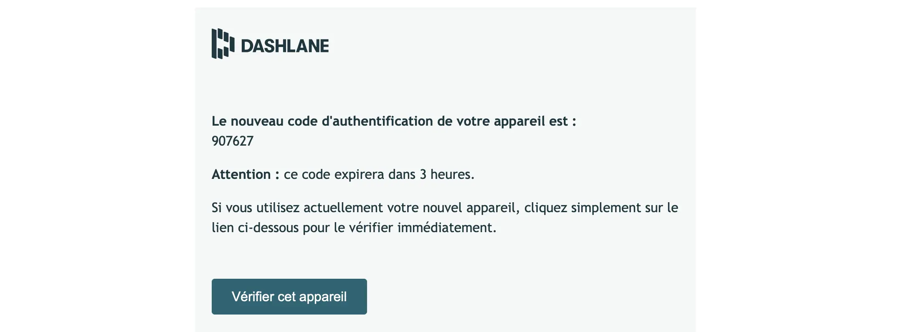
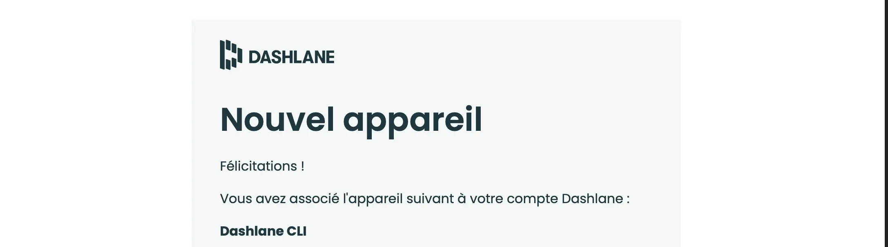
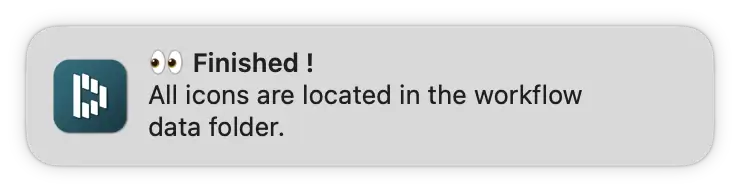
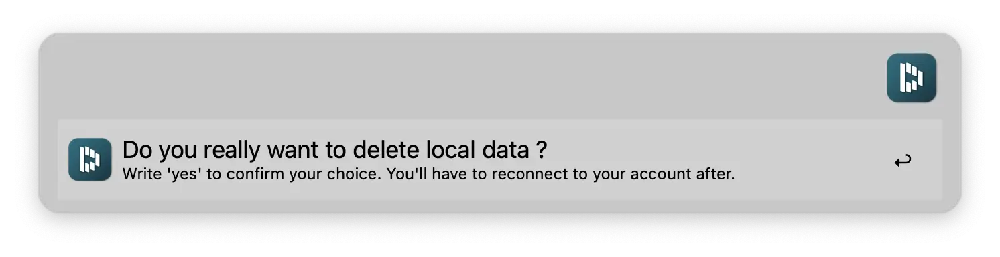
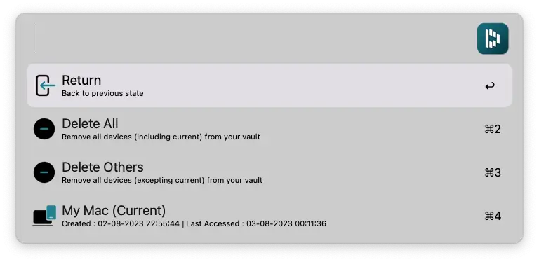
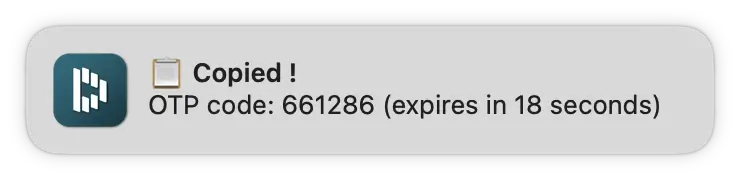

[](https://github.com/BenjaminOddou)
[](https://saythanks.io/to/BenjaminOddou)
[](https://www.python.org/downloads/macos/)

Welcome to the Alfred Dashlane repository: **An Alfred Workflow** ✨

## ✅ Prerequisites

* MacOS.
* Alfred 5. Note that the [Alfred Powerpack](https://www.alfredapp.com/powerpack/) is required to use workflows.
* A [Dashlane](https://www.dashlane.com/fr) account.
* Requires **python 3** or above.

## 🏎️ Dashlane CLI

This workflow uses the [Dashlane CLI](https://github.com/Dashlane/dashlane-cli) provided by the [Dashlane team](https://github.com/Dashlane).

This workflow doesn't hold or register any private data. No sensible data (password, OTP) are exposed directly to Alfred. If you want to know more on how data is stored on the computer, check this [README](https://github.com/Dashlane/dashlane-cli/blob/master/src/crypto/README.md).

This workflow doesn't allow to update or upload items to the Dashlane vault. You can't connect multiple accounts neither. This is a limitation of the Dashlane CLI for now.

## ⬇️ Installation

1. [Download the workflow](https://github.com/BenjaminOddou/alfred-dashlane/releases/latest)
2. Double click the `.alfredworkflow` file to install

## 🧰 Setup the workflow

Install Python 3 or above. Check your version with :

```shell
python --version
```

Install the Dashlane CLI binary using one of the two methods below.

1. Using the following command in your Terminal :

```shell
curl -sSL https://raw.githubusercontent.com/BenjaminOddou/alfred-dashlane/main/install.sh | bash
```

2. Manual installation instructions are available [here](https://github.com/Dashlane/dashlane-cli#how-to-install-manually)

## 🧙‍♂️ Invoke the workflow

There is 2 flows in this workflow :

1. The first one allows you to display all the credentials in your Dashlane vault. It can be triggered by writing `pdash` keyword.
2. The second one allows you to display your OTPs from you Dashlane vault. It can be triggered by writing `odash` keyword.

You can edit these triggers (flagged with a `🕹️` symbol) in the user configuration panel.

## 🤖 Usage of the workflow

### Setup variables

1. `👤 Login` correspond to your address mail link to your Dashlane account. **It is required to start the workflow**.

2. `🫥 Icognito mode` allows you to hide partially your login (mail address / user name). If ticked :


if unticked :


3. `🔥 Allow cache` enables the workflow to save a backbone (no confidentital data are stored) of your Dashlane vault as `JSON` files under the `alfred_workflow_cache` folder (`~/Library/Caches/com.runningwithcrayons.Alfred/Workflow Data/com.benjamino.dashlane`). This speeds up the response time.

4. `🎷 Notification sound` allows you to personalize the sound of the workflow notification.

### Get your one-time password (OTP) code by mail

> Note that if you have enabled the two steps authetication for your Dashlane account, you can skip this section.

In order to connect to your Dashlane account, you'll need an OTP. If you haven't configure the two steps authentication on your Dashlane account, just hit enter to receive the 6 digits code by mail.



### Sync your Dashlane account

❗ You need an internet connexion to complete this action.

Hit enter, input your master password and finally the OTP (provided via mail or by your 2FA app). If you are already connected you can press enter to refresh the data.

> Note that a sync is already done once per hour by default - see [Dashlane CLI docs](https://github.com/Dashlane/dashlane-cli).

You should have received a `✅ Success !` notification and a mail saying that the connection was successfull.




### Download favicons

❗ You need an internet connexion to complete this action.

Hit enter to download all favicons link to your accounts. Wait few seconds / minutes to receive the below notification. You can see icons under the `alfred_workflow_cache` folder (`~/Library/Caches/com.runningwithcrayons.Alfred/Workflow Data/com.benjamino.dashlane`).



### Reset local data

If you want to log out and / or remove all local data holds by the Dashlane CLI, hit enter. Confirm your action by inputing `yes` to the alfred search bar.



### Manage connected devices

Remove access to devices connected to your vault. Press <kbd>⌘</kbd><kbd>↩︎</kbd> on a device to remove it. You have the possibility to remove all devices (including current device) and other devices (excluding current device).



### Get passwords and OTPs

#### Password flow

> Use `pdash` keyword to launch this flow.

Search a password by typing its title (custom name or website link to the credentials). Don't forget to include a space between `pdash` and your `{query}`.

1. Press <kbd>↩︎</kbd> to copy the password. You should see the below notification popping.
2. Press <kbd>⌘</kbd><kbd>↩︎</kbd> to copy the login (No Login means that you only register a password for this element).
3. Press <kbd>⌥</kbd><kbd>↩︎</kbd> to open the url (No URL means that no website is link to this credentials).


#### OTP flow

> Use `odash` keyword to launch this flow.

Search an OTP by typing its title (custom name or website link to the credentials). Don't forget to include a space between `odash` and your `{query}`.

1. Press <kbd>↩︎</kbd> to copy the OTP. You should see the below notification popping.
2. Press <kbd>⌘</kbd><kbd>↩︎</kbd> to copy the login (No Login means that you only register a password for this element).
3. Press <kbd>⌥</kbd><kbd>↩︎</kbd>  to open the url (No URL means that no website is link to this credentials).



## ⚖️ License

[MIT License](LICENSE) © Benjamin Oddou
