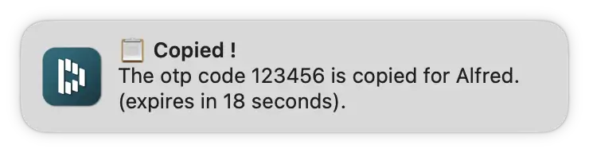

[](https://github.com/BenjaminOddou)
[](https://saythanks.io/to/BenjaminOddou)

Welcome to the Alfred Dashlane repository: **An Alfred Workflowk** ✨

## ✅ Prerequisite

* 🍎 MacOS.
* 🎩 Alfred 5. Note that the [Alfred Powerpack](https://www.alfredapp.com/powerpack/) is required to use workflows.
* 🔐 A [Dashlane](https://www.dashlane.com/fr) account.
* ❗ Requires **python 3** or above.

## 📯 Disclaimer

This workflow is provided "as is" without warranty of any kind, either expressed or implied. By using it, you have agreed to use the workflow "at your own risk" and you have ensured to have read this documentation.

This workflow uses the [Dashlane CLI](https://github.com/Dashlane/dashlane-cli) provided by the [Dashlane team](https://github.com/Dashlane). However, note that the **Dashlane, Inc. does not provide customer support on this project**.

This workflow doesn't hold or register any private data. However, by design it exposes all the Dashlane data to the Alfred app which allows to manipulate it. It's a different approach compare to the offical [1Password integration](https://www.alfredapp.com/help/features/1password/) from Alfred. If you want to know more on how data is stored on the computer, check this [README](https://github.com/Dashlane/dashlane-cli/blob/master/src/crypto/README.md).

This workflow doesn't allow to update or upload items to the Dashlane vault. You can't connect multiple accounts neither. This is a limitation of the Dashlane CLI for now.

## ⬇️ Installation

1. [Download the workflow](https://github.com/BenjaminOddou/alfred-dashlane/releases/latest)
2. Double click the `.alfredworkflow` file to install


## 🧙‍♂️ Invoke the Workflow

You can invoke the workflow by writing `webp` onto the Alfred search box. You can change this value by changing the `🕹️ Trigger` variable in workflow configuration panel [optionnal].

## 🧰 Setup the workflow

### 👨‍💻 Install dependencies

☑️ Install Python 3 or above. Check your version with :

```shell
python --version
```

☑️ Install the Dashlane CLI binary using one of the two methods below.

1. Using the following command in your Terminal :

```shell
curl -sSL https://raw.githubusercontent.com/BenjaminOddou/alfred-dashlane/main/install.sh | bash
```

2. Manual installation

* Download the Dashlane CLI (dcli-macos) via from the GitHub repo (https://github.com/Dashlane/dashlane-cli/releases/tag/v1.0.0).
* Modify its name to `dcli`.
* Move it to the `dcli` folder under the workflow data folder (`~/Library/Application Support/Alfred/Workflow Data/com.benjamino.dashlane`).
* Run the following command to remove notification module from quarantine :

```shell
sudo xattr -r -d com.apple.quarantine "$(dirname "$(find ~/Library/Application\ Support/Alfred/Alfred.alfredpreferences/workflows -name 'com.benjamino.dashlane' -type f)")/alfred_dashlane_notification.app"
```

### ⚒️ Setup variables

1. `👤 Login` correspond to your address mail link to your Dashlane account. **It is required to start the workflow**.

2. `🫥 Icognito mode` allows you to hide partially your login (mail address / user name). If `Yes 👍` is selected (by default) :


if `No 👎` is selected :


3. `🎷 Notification sound` allows you to personalize the sound of the workflow notification (not affecting other programs). Select a sound you like or mute it with `Mute 🔕`. To know more about notifications, see the `💬 About notifications` section below

## 🤖 Usage of the workflow

### 🔢 Get your one-time password (OTP) code by mail

> 💡 Note that if you have enabled the two steps authetication for your Dashlane account, you can skip this section.

In order to connect to your Dashlane account, you'll need an OTP. If you haven't configure the two steps authentication on your Dashlane account, just hit enter to receive the 6 digits code by mail.


### 🔄 Sync your Dashlane account

‼️ You need an internet connexion to complete this action.

Hit enter, input your master password and finally the OTP (provided via mail or by your 2FA app). If you are already connected you can press enter to refresh the data.

> 💡 Note that a sync is already done once per hour by default - see [Dashlane CLI docs](https://github.com/Dashlane/dashlane-cli).

You should have received a `✅ Success !` notification and a mail saying that the connection was successfull.


> 💡 Note that you will receive a mail even if the master password is incorrect. This is because the OTP code allows to register a device and make connections to the API when the master password is only here to decrypt the local vault that has been dowloaded during the sync event - see this [thread](https://github.com/Dashlane/dashlane-cli/issues/54)


After login you may be asked to approve the `dcli` binary with a message like this one :


Enter the password of your mac and press `always allow`. If this is not working, try to open the workflow in a terminal session like so :


Now copy the code below and press ⏎. It should trigger the same popup window asking to approve the binary.

```shell
./dcli/dcli sync
```

### ⬇️ Download favicons

‼️ You need an internet connexion to complete this action.

Hit enter to download all favicons link to your accounts. Wait few seconds / minutes to receive the below notification. You can see icons here :

```shell
~/Library/Application Support/Alfred/Workflow Data/com.benjamino.dashlane
```


### 🚮 Reset local data

If you want to log out and / or remove all local data holds by the Dashlane CLI, hit enter. Confirm your action by inputing `yes` to the alfred search bar.


### 🔓 Manage passwords and OTPs

#### Password flow

> 💡 Use `pdash` keyword to launch this flow.

Search a password by typing its title (custom name or website link to the credentials). Don't forget to include a space between `pdash` and your `{query}`.


1. Press ⏎ to copy the password.
2. Press ⌘⏎ to copy the login (No Login means that you only register a password for this element).
3. Press ⌥⏎ to open the url (No URL means that no website is link to this credentials). Alternatively press ⌘Y to preview the url.

**Using Alfred Universal Actions**

Select the element you want to display and run `Universal Actions` with →. It shows `Title`, `Login`, `Password` and `Url` link to the element.


If you want to know more on how to use Alfred Universal Actions, follow this [link](https://www.alfredapp.com/help/features/universal-actions/).

#### OTP flow

> 💡 Use `odash` keyword to launch this flow.

Search an OTP by typing its title (custom name or website link to the credentials). Don't forget to include a space between `odash` and your `{query}`.

Press ⏎ to copy the OTP. You should see the below notification popping.



In some edge cases when the title and the login are the same for multiple elements, you'll receive the below warning. Ensure that combination of title and login are unique between elements.


### 💬 About notifications

This workflow is using its own `notification module` independant from Alfred post notification. This allows more flexibility but you may need to allow some access to this `alfred_dashlane_notification`.


You'll find all the notifications in the notification center.


> 💡 Note that you may encounter some `ghost notifications` the first time you are using the workflow (notification immediatly disappears). If it persists, try to restart your computer. You'll also see a slight popup in the dock when a notification appears.

### 📋 About clipboard

By default, all items that fall in the clipboard (passwords, logins and otps) are transient, meaning they will not fall in the Alfred clipboard history. This is actually wanted as these are sensitive data, but you can change this behavior by unticking the box `Mark item as transient in clipboard` in the `Copy to Clipboard` element in the workflow.


## ⚖️ License

[MIT License](LICENSE) © Benjamin Oddou
